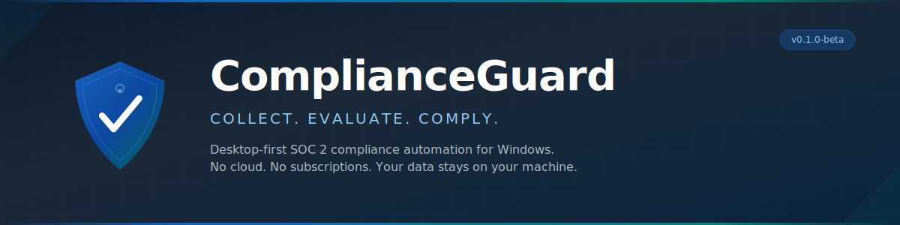
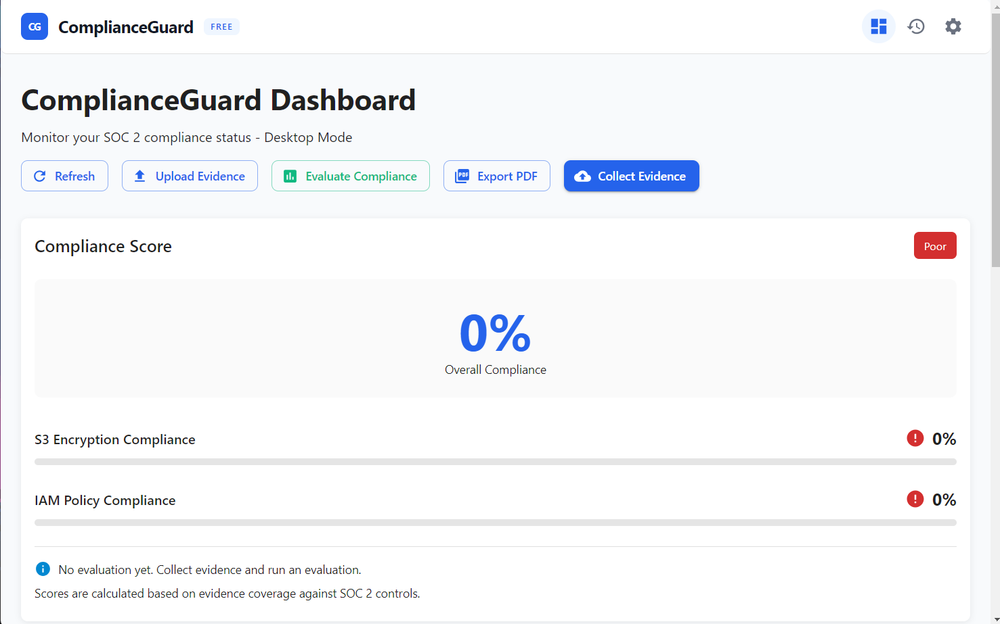
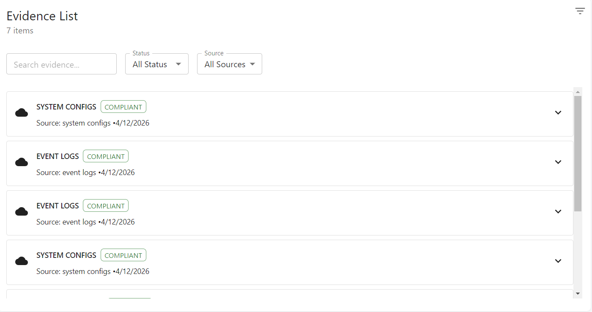

<p align="center">
  
</p>

<p align="center">
  <a href="#quick-start"></a>
  
  <a href="#soc-2-controls"></a>
  
  
  <a href="https://github.com/Egyan07/ComplianceGuard/actions"></a>
</p>


Compliance tools like Vanta, Drata, and Sprinto scan your cloud infrastructure. That's useful — but they can't see what's happening **on the machines themselves**. Password policies, firewall rules, event logs, running services, local user accounts — that evidence lives on the endpoint, not in AWS.

ComplianceGuard lives on the endpoint too. It collects evidence directly from Windows, scores it against 29 SOC 2 Type II controls, and tells you exactly where the gaps are. Run it as a desktop app or deploy the web version with Docker — everything stays under your control.

```
                    ┌─────────────┐
  Windows OS ──────>│ Collect     │──────> SQLite / PostgreSQL
  Event logs        │ Evidence    │        (local or hosted)
  Registry          └──────┬──────┘
  Services                 │
  Firewall                 ▼
  Users            ┌─────────────┐
  Network          │ Evaluate    │──────> Score + Gaps
  Software         │ Compliance  │        per SOC 2 control
                   └──────┬──────┘
                          │
                          ▼
                   ┌─────────────┐
                   │ Report      │──────> PDF / Dashboard
                   └─────────────┘
```

## Choose Your Privacy Level

Every organisation has different requirements. ComplianceGuard gives you full control over where your data lives.

### Maximum Privacy — Self-Host
> *"My data never leaves my infrastructure."*

Deploy the web dashboard on your own server (Railway, Render, DigitalOcean, or any VPS). Your compliance data stays entirely within your control. Nobody — not even ComplianceGuard — can access it. Perfect for regulated industries, government contractors, legal firms, healthcare, and air-gapped environments.

**You manage the server. You own the data. You pay less.**

### Maximum Convenience — Hosted by Us
> *"I just want it to work without managing servers."*

Contact us to set up a hosted instance. Install the desktop app on your machines, enter your credentials, and you are running. We handle uptime, backups, updates, and infrastructure. Your endpoint evidence stays on your machines until you choose to sync.

**We manage the server. You own the data. Zero setup required.**

> Either way — the endpoint evidence collected from your Windows machines never leaves your local machine until you explicitly choose to sync it to the dashboard.

---

## Demo

<video src="https://github.com/user-attachments/assets/ae1dfc02-fac4-4c9e-9736-9cd7b96b22af" controls width="100%"></video>

_A walkthrough of ComplianceGuard in action — collecting endpoint evidence, uploading manual documents, evaluating compliance against 29 SOC 2 controls, exporting a PDF report, and managing a Pro license from Settings._

## Screenshots

### Dashboard



The dashboard shows your real-time compliance score, per-category breakdowns, and one-click access to collect evidence, run an evaluation, upload manual evidence, and export a PDF report.

### Evidence List



All collected evidence items in one place — searchable and filterable by status and source. Each item shows its compliance status, collection date, and can be expanded for full details.

## Quick Start

### Option A — Windows Installer (Recommended)

Download `ComplianceGuard-Setup.exe` from the [latest release](https://github.com/Egyan07/ComplianceGuard/releases/latest), run the installer, and launch from the Start Menu.

> ⚠️ Windows may show a SmartScreen warning as the installer is not yet code signed. Click **More info → Run anyway** to proceed. Alternatively, download the **portable `.exe`** from the same release — no installation required and no SmartScreen prompt.

> **Requirements:** Windows 10/11 (64-bit)

### Option B — One-Click Setup (Development)

```bash
git clone https://github.com/Egyan07/ComplianceGuard.git
```

1. Double-click **`install.bat`** — installs all dependencies, sets up the database, and creates `start.bat`
2. Double-click **`start.bat`** — choose Desktop or Web mode and you are running

> **Prerequisites:** Windows 10/11, [Node.js 18+](https://nodejs.org/), [Python 3.10+](https://www.python.org/downloads/)

### Option C — Manual Setup

<details>
<summary>Desktop (Electron)</summary>

```bash
git clone https://github.com/Egyan07/ComplianceGuard.git
cd ComplianceGuard
npm install && cd frontend && npm install && cd ..
npm run dev
```

</details>

<details>
<summary>Web — Self-Hosted (Docker)</summary>

```bash
git clone https://github.com/Egyan07/ComplianceGuard.git
cd ComplianceGuard
cp .env.example .env          # configure your settings
docker-compose up -d
```

App at `http://localhost` (nginx proxy), API docs at `http://localhost:8000/docs`. Requires [Docker](https://docs.docker.com/get-docker/).

One-click Railway deploy:

[](https://railway.app)

</details>

<details>
<summary>Web — Local Development (without Docker)</summary>

```bash
# Terminal 1 — Backend
cd backend
pip install -r requirements.txt
python -m uvicorn app.main:app --reload --port 8000

# Terminal 2 — Frontend
cd frontend
npm install
npm run dev
```

App at `http://localhost:5173`. Create an account on first run.

</details>

<details>
<summary>Web — Hosted by Us</summary>

Contact us at [alexisegyan1232@gmail.com](mailto:alexisegyan1232@gmail.com) to set up a managed hosted instance. We handle deployment, uptime, backups, and updates. You just install the desktop app and connect.

</details>

<details>
<summary>Build Windows Installer</summary>

```bash
npm run package    # outputs to dist/
```

</details>

## What Makes This Different

| | ComplianceGuard | Vanta / Drata / Sprinto |
|---|---|---|
| **Where it runs** | On your machine or self-hosted | In the cloud |
| **What it scans** | OS-level: event logs, registry, services, firewall, users | Cloud infra: AWS, GCP, Azure |
| **Data residency** | Never leaves your control | Stored on vendor servers |
| **Self-hosted option** | ✅ Full control | ❌ Cloud only |
| **Air-gapped networks** | Desktop works completely offline | Requires internet |
| **Cost** | Free tier available, Pro from $49/mo | $8k–$10k/year |
| **SOC 2 controls** | 29 implemented | Varies |
| **Open source** | ✅ BSL 1.1 | ❌ Closed source |

They scan the cloud. We scan the machine. Use both and you have covered the full stack.

## What It Collects

ComplianceGuard pulls 8 categories of evidence from Windows:

| Category | What's Collected | Maps To |
|----------|-----------------|---------|
| Event Logs | Security, System, Application logs | CC7.1, CC4.1 |
| Security Settings | Password policies, audit policies, registry options | CC6.1, CC6.2, CC6.3 |
| Services | Defender, Windows Update, Firewall, Event Log status | A1.1, CC7.2 |
| Firewall | Domain, Private, Public profile configuration | CC6.5 |
| User Accounts | Local accounts, admin group membership | CC6.2, CC6.4 |
| Network | Interfaces, open ports, routing tables | CC6.5, CC6.7 |
| Software | Registry-based inventory of installed programs | CC7.2, CC8.1 |
| File Permissions | ACLs on critical system paths | CC6.1, CC6.3 |

Each evidence item is SHA-256 hashed for integrity and stored with full audit logging.

## SOC 2 Controls

29 controls across 4 categories. Each is scored by evidence coverage with configurable weights.

<details>
<summary><strong>Common Criteria (CC) — 17 controls</strong></summary>

| ID | Control | Weight |
|----|---------|--------|
| CC1.1 | Integrity and Ethical Values | 15% |
| CC1.2 | Board Independence | 10% |
| CC2.1 | Internal Communication | 10% |
| CC3.1 | Risk Assessment | 12% |
| CC4.1 | Monitoring | 13% |
| CC5.1 | Control Activities | 15% |
| CC6.1 | Logical Access Controls | 20% |
| CC6.2 | Authentication | 18% |
| CC6.3 | Authorization | 18% |
| CC6.4 | Segregation of Duties | 15% |
| CC6.5 | Network Security | 17% |
| CC6.6 | Physical Access | 12% |
| CC6.7 | Data Transmission | 15% |
| CC7.1 | Event Logging | 18% |
| CC7.2 | Vulnerability Management | 16% |
| CC8.1 | Change Management | 14% |
| CC9.1 | Risk Mitigation | 12% |

</details>

<details>
<summary><strong>Availability (A) — 4 controls</strong></summary>

| ID | Control | Weight |
|----|---------|--------|
| A1.1 | System Availability | 25% |
| A1.2 | Environmental Protection | 20% |
| A1.3 | Capacity Management | 20% |
| A1.4 | Backup and Recovery | 35% |

</details>

<details>
<summary><strong>Confidentiality (C) — 4 controls</strong></summary>

| ID | Control | Weight |
|----|---------|--------|
| C1.1 | Data Classification | 25% |
| C1.2 | Data Protection | 30% |
| C1.3 | Data Disposal | 20% |
| C1.4 | Disclosure Controls | 25% |

</details>

<details>
<summary><strong>Processing Integrity (PI) — 4 controls</strong></summary>

| ID | Control | Weight |
|----|---------|--------|
| PI1.1 | Processing Accuracy | 25% |
| PI1.2 | Input Controls | 25% |
| PI1.3 | Error Detection | 25% |
| PI1.4 | Output Review | 25% |

</details>

## Architecture

<details>
<summary><strong>Click to expand</strong></summary>

ComplianceGuard runs in two modes: Desktop (Electron + SQLite) for offline use, and Web (FastAPI + PostgreSQL + React) for hosted deployments. The frontend auto-detects which mode it's in.

```
┌──────────────────────────────────────────────────────────────┐
│  DESKTOP MODE (Electron)                                      │
│                                                               │
│  ┌─────────────────┐  ┌───────────────────────────────────┐  │
│  │ Evidence        │  │ Compliance Engine                  │  │
│  │ Processor       │  │ 29 controls · weighted scoring     │  │
│  │ Collect · Store │  │ gap analysis · recommendations     │  │
│  └────────┬────────┘  └───────────────┬───────────────────┘  │
│           └──────────┬────────────────┘                       │
│                      ▼                                        │
│           ┌─────────────────────┐                             │
│           │  SQLite + Audit Log │                             │
│           └─────────────────────┘                             │
│                      ▲                                        │
│           ┌──────────┴──────────┐  ┌────────────────────┐    │
│           │ Windows Collector   │  │ License Manager     │    │
│           │ PowerShell + WMI    │  │ Ed25519 · Offline   │    │
│           └─────────────────────┘  └────────────────────┘    │
└──────────────────────┬────────────────────────────────────────┘
                       │ IPC (context-isolated, validated)
                       ▼
┌──────────────────────────────────────────────────────────────┐
│  REACT FRONTEND                                               │
│  Dashboard · Score · Evidence · History · Settings · License  │
│  Auto-detects Electron (IPC) vs Web (HTTP) mode               │
└──────────────────────────────────────────────────────────────┘
                       ▲
                       │ HTTP / REST API
                       ▼
┌──────────────────────────────────────────────────────────────┐
│  WEB MODE (Self-Hosted or Managed)                            │
│                                                               │
│  ┌─────────────────┐  ┌───────────────────────────────────┐  │
│  │ FastAPI Backend  │  │ PostgreSQL                        │  │
│  │ Auth · Evidence  │  │ Users · Companies · Compliance    │  │
│  │ Compliance API   │  │ Evidence · Frameworks             │  │
│  └─────────────────┘  └───────────────────────────────────┘  │
│                                                               │
│  Your server OR our managed infrastructure —                  │
│  your choice, your data stays yours either way.               │
└──────────────────────────────────────────────────────────────┘
```

Key files:

```
ComplianceGuard/
├── backend/
│   ├── app/
│   │   ├── main.py                     # FastAPI app, CORS, routes
│   │   ├── api/                        # Auth, evidence, compliance endpoints
│   │   ├── core/                       # Config, database, SOC 2 controls, auth
│   │   ├── models/                     # SQLAlchemy models (user, company, compliance, evidence)
│   │   ├── services/                   # Compliance service, evidence collector
│   │   └── integrations/aws.py         # AWS evidence collection
│   ├── migrations/                     # Alembic database migrations
│   ├── tests/                          # Unit (152) + integration (35) + e2e (5) tests
│   ├── requirements.txt
│   └── Dockerfile
├── electron/
│   ├── main.js                         # Window mgmt, IPC handlers, tray
│   ├── preload.js                      # Secure IPC bridge with validation
│   ├── database/sqlite.js              # SQLite operations, backup
│   ├── licensing/
│   │   ├── generate-key.js             # Ed25519 keypair + license key generator
│   │   ├── license-crypto.js           # Signature verification (public key only)
│   │   ├── license-manager.js          # License state, feature gates, persistence
│   │   └── tier-constants.js           # Free vs Pro feature definitions
│   ├── processing/
│   │   ├── compliance-engine.js        # SOC 2 scoring engine (tier-aware)
│   │   ├── evidence-processor.js       # Evidence collection + storage
│   │   └── report-generator.js         # HTML → PDF report generation
│   └── system/windows.js               # Windows evidence collector
├── frontend/
│   ├── src/
│   │   ├── App.tsx                     # Theme, nav, auth gate, error boundary
│   │   ├── components/                 # Dashboard, Score, Evidence, History, Settings, Login
│   │   ├── contexts/AuthContext.tsx     # JWT auth state, login/register/logout
│   │   ├── contexts/LicenseContext.tsx  # React context for tier state + feature checks
│   │   ├── services/api.ts             # Unified API (IPC or HTTP)
│   │   └── test/                       # Vitest test suite (114 tests)
│   ├── e2e/                            # Playwright e2e tests (5 tests)
│   ├── .eslintrc.cjs
│   ├── .prettierrc
│   └── Dockerfile
├── assets/
│   ├── banner.svg
│   └── screenshots/                    # Dashboard.png, EvidenceCollection.png
├── resources/icons/                    # App icons (ico, png, svg, tray)
├── install.bat                         # One-click setup (installs deps, creates start.bat)
├── .github/workflows/ci.yml            # Backend Tests → Lint & Test → Build
├── docker-compose.yml                  # PostgreSQL + Backend + Frontend + Nginx
├── nginx.conf                          # Reverse proxy, rate limiting, security headers
├── .env.example                        # Environment config template
└── package.json                        # Electron + build config
```

</details>

## Limitations

ComplianceGuard is designed for Windows endpoints. The following limitations apply in the current release:

- **Windows only** — evidence collection uses PowerShell, WMI, and the Windows registry. macOS and Linux support is on the roadmap.
- **No automatic scheduling** — evidence must be collected manually or triggered via the dashboard. Scheduled collection is planned.
- **Per-machine view in desktop mode** — the Electron app shows one machine at a time. Use web mode (self-hosted or managed) with the Cloud Dashboard to monitor multiple machines centrally.
- **AWS only for cloud evidence** — the web backend collects S3 and IAM evidence from AWS. GCP and Azure are not yet implemented.
- **SOC 2 Type II only** — ISO 27001, HIPAA, and PCI DSS frameworks are in development.
- **Single machine in free tier** — the free tier is limited to one machine. Pro supports up to 10, Enterprise is unlimited.
- **No real-time monitoring** — ComplianceGuard takes point-in-time snapshots, not continuous streams.
- **PDF reports require Pro** — the free tier shows your overall score but does not generate audit-ready PDF exports.

## Pricing

Free gets you hooked. Pro makes you audit-ready.

### Self-Hosted (You Manage the Server)

| | **Free** | **Pro** | **Enterprise** |
|---|---|---|---|
| **Price** | $0 forever | $49/mo | $249/mo + $12/machine |
| Evidence collection (all 8 categories) | ✅ | ✅ | ✅ |
| SOC 2 controls | 12 core controls | All 29 controls | All 29 controls |
| Overall compliance score | ✅ | ✅ | ✅ |
| Per-control scoring + gap details | — | ✅ | ✅ |
| Remediation recommendations | — | ✅ | ✅ |
| Upload manual evidence (policies, docs) | — | ✅ | ✅ |
| Evaluation history + trends | — | ✅ | ✅ |
| PDF audit-ready reports | — | ✅ | ✅ |
| Cloud dashboard (multi-machine) | — | ✅ | ✅ |
| Machines | 1 | Up to 10 | Unlimited |
| Users | 1 | Up to 10 | Unlimited |
| Support | Community | Email | Dedicated |

### Managed Hosting (We Manage the Server)

| | **Pro Managed** | **Enterprise Managed** |
|---|---|---|
| **Price** | $79/mo | $449/mo + $18/machine |
| Everything in Self-Hosted Pro/Enterprise | ✅ | ✅ |
| Zero server setup required | ✅ | ✅ |
| We handle uptime, backups, updates | ✅ | ✅ |
| Onboarding assistance | ✅ | ✅ |
| Dedicated infrastructure | — | ✅ |

**Self-hosted:** Your data stays entirely on your infrastructure. Lower price because you manage the server. Perfect for regulated industries, government contractors, legal firms, and air-gapped environments.

**Managed:** We host the dashboard for you. Zero setup. Higher price because we do the work. Same data sovereignty principles — your endpoint evidence never leaves your machines until you sync.

License keys use Ed25519 cryptographic signatures — verified offline, no license server required.

## Who Is This For?

| Organisation Type | Recommended Option | Why |
|---|---|---|
| Government contractors | Self-hosted Enterprise | Data sovereignty requirements |
| NHS / Healthcare | Self-hosted Enterprise | NHS DSPT, patient data governance |
| Legal firms | Self-hosted Pro/Enterprise | Client confidentiality, SRA |
| Financial services | Self-hosted Enterprise | FCA data residency |
| Accounting firms | Self-hosted or Managed Pro | HMRC data, GDPR Article 32 |
| Air-gapped environments | Desktop only | Zero network traffic |
| Startups / SMBs | Managed Pro | Zero setup, fast onboarding |
| IT consultants | Self-hosted Pro | Manage multiple clients |

## Security Model

All data stays under your control. Zero telemetry.

| Layer | How |
|-------|-----|
| IPC | Context isolation. Every exposed method validates input types and uses allowlists. |
| Evidence | Full audit trail with timestamps. Streaming upload with early abort on size/type violation. |
| Database | Parameterized queries. Foreign key constraints. Alembic-managed migrations. |
| Navigation | External URLs blocked. `window.open` denied. |
| Licensing | Ed25519 signed keys. Only the public key ships with the app. |
| Auth (Web) | JWT access tokens (30 min) + DB-backed revocable refresh tokens (7 days). Bcrypt hashing. Email verification enforced. Password complexity + reset with expiring tokens. `POST /api/v1/auth/logout` revokes the refresh token JTI. |
| License (Web) | Ed25519 signed keys verified in Python (`cryptography`). `require_pro` dependency returns HTTP 402. License email validated on activation. |
| Rate Limiting | 5 req/min on login, 3/min on register. Redis shared backend supported via `RATELIMIT_STORAGE_URI`. Nginx rate limiting at proxy layer. |
| Error Monitoring | Sentry integration on backend (FastAPI + SQLAlchemy) and frontend. `send_default_pii=False`. Silent no-op when DSN unset. |
| Proxy | Nginx reverse proxy with CSP, HSTS, Permissions-Policy, X-Frame-Options, X-Content-Type-Options. |

For reporting security vulnerabilities, see [SECURITY.md](SECURITY.md).

## Development

### Desktop

```bash
npm run dev              # Electron + React dev server
npm run build            # Build frontend
npm run package          # Windows installer (.msi + .nsis)
```

### Web / Backend

```bash
docker-compose up -d     # Start all services
docker-compose down      # Stop all services
```

```bash
cd backend
pip install -r requirements.txt
alembic upgrade head                 # Run database migrations
uvicorn app.main:app --reload        # Run backend locally
```

### Tests

```bash
# Frontend (Vitest unit + Playwright e2e)
cd frontend
npm test                 # Vitest unit tests
npm run test:e2e         # Playwright e2e tests
npm run lint             # ESLint
npm run format:check     # Prettier

# Backend (152 unit + 35 integration + 5 e2e skipped by default)
cd backend
python -m pytest tests/unit/ -v
python -m pytest tests/integration/ -v
python -m pytest tests/e2e/ -v --run-e2e
```

CI runs all tests on every push via GitHub Actions. Backend: **187 tests passing** (152 unit + 35 integration).

## Troubleshooting

| Issue | Solution |
| :--- | :--- |
| **`install.bat` fails with "Node.js not found"** | Install [Node.js 18+](https://nodejs.org/) and ensure it is added to your PATH. Restart your terminal after installation. |
| **`install.bat` fails with "Python not found"** | Install [Python 3.10+](https://www.python.org/downloads/) and check "Add Python to PATH" during setup. |
| **Backend starts but frontend shows blank screen** | Run `cd frontend && npm install` then `npm run build`. In desktop mode, ensure the Vite dev server is running on port 5173. |
| **Docker Compose fails with "port already in use"** | Stop any existing services on ports 80, 8000, or 5432, then re-run `docker-compose up -d`. |
| **Evidence collection returns empty results** | Run the app as Administrator. Some Windows registry and event log queries require elevated privileges. |
| **`alembic upgrade head` fails** | Ensure `DATABASE_URL` in your `.env` is set correctly. For local SQLite, use `sqlite:///./complianceguard.db`. |
| **License key not activating** | License keys are tied to the Ed25519 public key bundled with the app. Ensure you are using a key generated for this build. |
| **CI fails with `ERR_MODULE_NOT_FOUND`** | Run `cd frontend && npm install react-transition-group` to install the missing peer dependency. |


## FAQ

### Is my compliance data sent anywhere?
> No. All evidence collection, scoring, and storage happens locally on your machine or on your own hosted infrastructure. There is no telemetry and no data leaves your control.

### What is the difference between self-hosted and managed?
> Self-hosted means you run the web dashboard on your own server — Railway, Render, DigitalOcean, or any VPS. Managed means we run it for you. Either way, the endpoint evidence collected from your Windows machines stays local until you explicitly sync it. The difference is who manages the server infrastructure.

### Does ComplianceGuard replace a SOC 2 auditor?
> No. It automates evidence collection and gives you a readiness score, but a formal SOC 2 audit still requires a licensed CPA firm. Think of ComplianceGuard as audit preparation, not audit replacement.

### Can I use the free tier for a real audit?
> The free tier is useful for assessing your current posture. For an actual audit you will need Pro, which unlocks the full 29-control breakdown, gap details, remediation recommendations, and PDF exports that auditors expect.

### What happens to my data if I stop using ComplianceGuard?
> Your data is stored in a local SQLite file (Desktop mode) or your own PostgreSQL instance (Web mode). Uninstalling the app or deleting the database file removes all data permanently.

### Is the source code auditable?
> Yes. The full source is available in this repository under the Business Source License. You can inspect every line of the evidence collection and scoring logic.

### Will macOS and Linux be supported?
> They are on the roadmap. The backend and frontend are already cross-platform. The main work required is porting the Windows-specific evidence collector to macOS and Linux equivalents.

### How do I get a Pro or Enterprise license key?
> Contact [alexisegyan1232@gmail.com](mailto:alexisegyan1232@gmail.com) for licensing. Managed hosted instances are also available — we handle deployment and infrastructure for you.

### What is the Cloud Dashboard?
> The Cloud Dashboard allows you to monitor multiple machines from one centralized web view. Each Windows machine runs the Electron desktop app. Go to Settings > Cloud Sync, enter your web server URL and credentials, and click Sync to Cloud. The web dashboard then shows all machines' compliance scores, last sync time, and fleet-level stats. Available for Pro and Enterprise users.

### Can I use this in an air-gapped environment?
> Yes. The Desktop (Electron) mode works completely offline with no network traffic. Evidence is collected locally, stored in SQLite, and never leaves the machine unless you configure cloud sync. Perfect for classified, government, or highly regulated environments.


## Contributing

Contributions are welcome. Before submitting a pull request, please:

- Add tests for any new functionality
- Ensure all existing tests pass (`npm test` + `pytest`)
- Follow existing code style (ESLint + Prettier for frontend, flake8 for backend)
- Update documentation for any user-facing changes

See [CONTRIBUTING.md](CONTRIBUTING.md) for full guidelines.

## Roadmap

| Done | Up Next |
|------|---------|
| Evidence collection (8 categories) | Scheduled automatic collection |
| 29 SOC 2 controls with weighted scoring | ISO 27001 framework |
| PDF reports + evaluation history | HIPAA framework |
| Free / Pro / Enterprise licensing (Ed25519) | macOS and Linux support |
| JWT auth + refresh tokens + login UI | GCP and Azure cloud evidence |
| FastAPI + PostgreSQL + Docker + Nginx | Air-gapped Enterprise tier |
| Cloud sync + multi-machine dashboard | Setup video walkthrough |
| Email delivery (verification + reset) | One-click Railway deploy button |
| Web mode license enforcement (Ed25519) | |
| Sentry error monitoring (backend + frontend) | |
| Self-hosted + Managed hosting options | |
| CI/CD with 187 backend tests (unit + integration) | |
| Alembic migrations + rate limiting | |

## License

Business Source License 1.1 — free to use, modify, and self-host. You may not offer ComplianceGuard as a competing hosted commercial service. See [LICENSE](LICENSE) for full terms.

See [CHANGELOG.md](CHANGELOG.md) for full version history.

---

<p align="center">
  <strong>ComplianceGuard</strong> — Collect. Evaluate. Comply.
  <br><br>
  Built by <a href="https://github.com/Egyan07">Egyan07</a>
  <br><br>
  <a href="mailto:alexisegyan1232@gmail.com"></a>
  &nbsp;
  <a href="https://github.com/Egyan07/ComplianceGuard/issues">Report a bug</a> · <a href="https://github.com/Egyan07/ComplianceGuard/issues/new">Request a feature</a>
</p>
