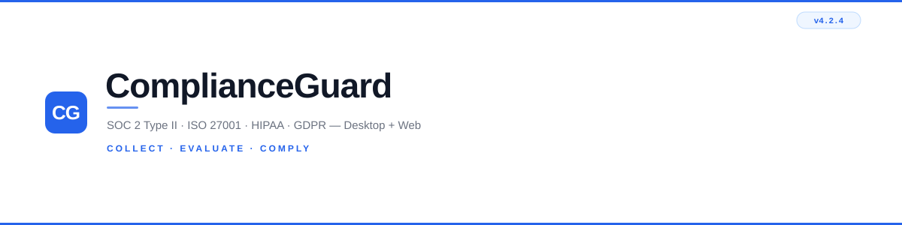
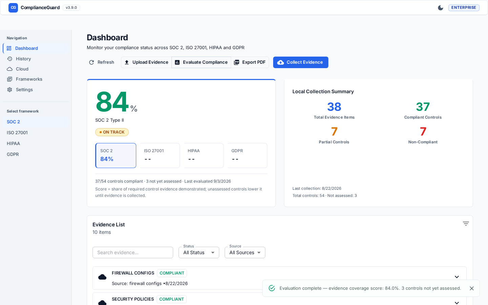
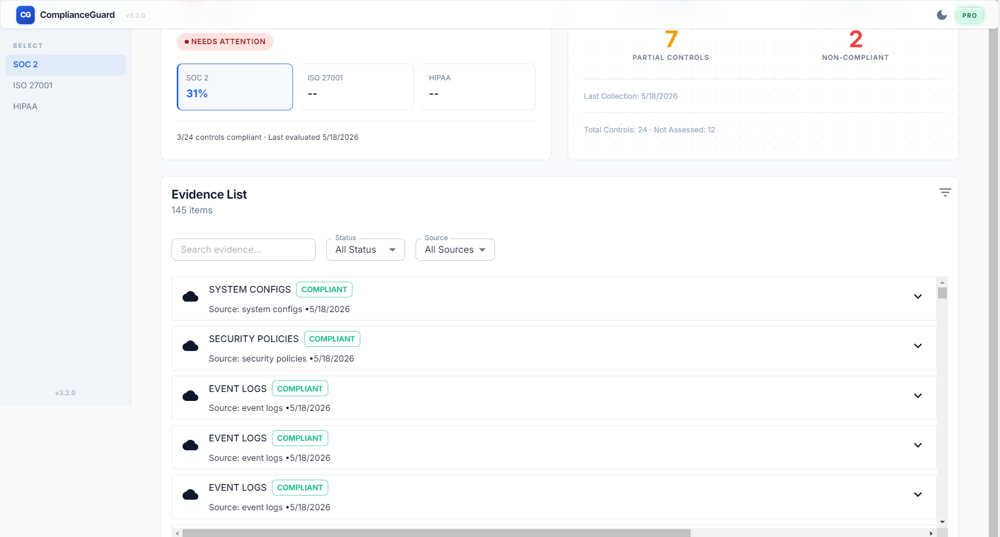

<p align="center">
  
</p>

<p align="center">
  <a href="#quick-start"></a>
  
  <a href="#compliance-frameworks"></a>
  
  
  <a href="https://github.com/Egyan07/ComplianceGuard/actions"></a>
</p>


Compliance tools like Vanta, Drata, and Sprinto scan your cloud infrastructure. That's useful — but they can't see what's happening **on the machines themselves**. Password policies, firewall rules, event logs, running services, local user accounts — that evidence lives on the endpoint, not in AWS.

ComplianceGuard lives on the endpoint too. It collects evidence directly from Windows and macOS, scores it against SOC 2 Type II, ISO 27001:2013, HIPAA Security Rule, and GDPR controls, and tells you exactly where the gaps are — across all four frameworks in a single collection pass. Run it as a desktop app or deploy the web version with Docker — everything stays under your control.

How it works: the desktop app collects OS-level evidence → maps it to compliance controls → scores your readiness → optionally syncs to a multi-machine cloud dashboard.

```
                    ┌─────────────┐
  Windows OS ──────>│ Collect     │──────> SQLite / PostgreSQL
  Event logs        │ Evidence    │        (local or hosted)
  Registry          └──────┬──────┘
  Services                 │
  Firewall                 ▼
  Users            ┌─────────────┐
  Network          │ Evaluate    │──────> Score + Gaps
  Software         │ Compliance  │        per control
                   └──────┬──────┘
                          │
                          ▼
                   ┌─────────────┐
                   │ Report      │──────> PDF / Dashboard
                   └─────────────┘
```

## Demo

<video src="https://github.com/user-attachments/assets/ae1dfc02-fac4-4c9e-9736-9cd7b96b22af" controls width="100%"></video>

_A walkthrough of ComplianceGuard in action — collecting endpoint evidence, evaluating compliance across SOC 2 controls, drilling into the per-control heatmap, downloading a remediation script, tracking score trends over time, and exporting an audit-ready PDF report._

## Screenshots

### Dashboard



The dashboard shows your real-time compliance score, per-category breakdowns, and one-click access to collect evidence, run an evaluation, upload manual evidence, and export a PDF report. The per-control heatmap below shows exactly which of the 54 SOC 2 controls are passing, partial, or failing — with inline remediation scripts for automatable findings.

### Evidence List



All collected evidence items in one place — searchable and filterable by status and source. Each item shows its compliance status, collection date, and can be expanded for full details.

## Who Is This For?

- Security and IT teams preparing for SOC 2, ISO 27001, HIPAA, or GDPR audits
- Companies that need endpoint-level evidence, not just cloud infrastructure scanning
- Teams requiring self-hosting, air-gapped deployment, or strict data residency
- Government bodies, NHS/healthcare, legal firms, and financial services needing full data sovereignty and tamper-evident compliance audit trails (Enterprise tier)

## Not a Good Fit If

- You only need cloud compliance — [Vanta](https://www.vanta.com/) or [Drata](https://drata.com/) cover that better
- Your endpoints run Linux (Windows and macOS are supported; Linux is on the roadmap)
- You want a fully managed SaaS with zero self-hosting involvement

## Choose Your Privacy Level

Every organisation has different requirements. ComplianceGuard gives you full control over where your data lives.

### Maximum Privacy — Self-Host
> *"My data never leaves my infrastructure."*

Deploy the web dashboard on your own server (Railway, Render, DigitalOcean, or any VPS). Your compliance data stays entirely within your control. Nobody — not even ComplianceGuard — can access it. Perfect for regulated industries, government contractors, legal firms, healthcare, and air-gapped environments.

**You manage the server. You own the data. You pay less.**

### Maximum Convenience — Hosted by Us
> *"I just want it to work without managing servers."*

Contact us to set up a hosted instance. Install the desktop app on your machines, enter your credentials, and you are running. We handle uptime, backups, updates, and infrastructure. Your endpoint evidence stays on your machines until you choose to sync.

**We manage the server. You own the data. Zero setup required.**

> Either way — the endpoint evidence collected from your machines never leaves your local machine until you explicitly choose to sync it to the dashboard.

---

## Quick Start

### Option A — Windows Installer (Recommended)

Download `ComplianceGuard-Setup.exe` from the [latest release](https://github.com/Egyan07/ComplianceGuard/releases/latest), run the installer, and launch from the Start Menu.

> **Requirements:** Windows 10/11 (64-bit)

<details>
<summary>Desktop — macOS (unsigned)</summary>

1. Download `ComplianceGuard-{version}-arm64.dmg` (Apple Silicon) or `ComplianceGuard-{version}.dmg` (Intel)
   from the [latest release](https://github.com/Egyan07/ComplianceGuard/releases/latest)
2. Open the DMG and drag ComplianceGuard to Applications
3. **First launch — Gatekeeper bypass (one time only):**
   - Right-click the app in Applications → Open → Open Anyway, **or**
   - Run in Terminal: `xattr -cr /Applications/ComplianceGuard.app`
4. Launch normally from Applications or Spotlight thereafter

> Code signing will be enabled in a future release, removing this step.

> **Requirements:** macOS 12 Monterey or later · Intel or Apple Silicon

</details>

### Option B — One-Click Setup (Development)

```bash
git clone https://github.com/Egyan07/ComplianceGuard.git
```

1. Double-click **`install.bat`** — installs all dependencies, sets up the database, and creates `start.bat`
2. Double-click **`start.bat`** — choose Desktop or Web mode and you are running

> **Prerequisites:** Windows 10/11, [Node.js 18+](https://nodejs.org/), [Python 3.10+](https://www.python.org/downloads/)

### Option C — Manual Setup

<details>
<summary>Desktop (Electron)</summary>

```bash
git clone https://github.com/Egyan07/ComplianceGuard.git
cd ComplianceGuard
npm install && cd frontend && npm install && cd ..
npm run dev
```

</details>

<details>
<summary>Web — Self-Hosted (Docker)</summary>

```bash
git clone https://github.com/Egyan07/ComplianceGuard.git
cd ComplianceGuard
cp .env.example .env          # configure your settings
docker-compose up -d
```

App at `http://localhost` (nginx proxy), API docs at `http://localhost:8000/docs`. Requires [Docker](https://docs.docker.com/get-docker/).

One-click Railway deploy:

[](https://railway.com/new/template?template=https://github.com/Egyan07/ComplianceGuard)

</details>

<details>
<summary>Web — Local Development (without Docker)</summary>

```bash
# Terminal 1 — Backend
cd backend
pip install -r requirements.txt
python -m uvicorn app.main:app --reload --port 8000

# Terminal 2 — Frontend
cd frontend
npm install
npm run dev
```

App at `http://localhost:5173`. Create an account on first run.

</details>

<details>
<summary>Web — Hosted by Us</summary>

Contact us at [alexisegyan1232@gmail.com](mailto:alexisegyan1232@gmail.com) to set up a managed hosted instance. We handle deployment, uptime, backups, and updates. You just install the desktop app and connect.

</details>

<details>
<summary>Build Windows Installer</summary>

```bash
npm run package    # outputs to dist/
```

</details>

## What Makes This Different

| | ComplianceGuard | Vanta / Drata / Sprinto |
|---|---|---|
| **Where it runs** | On your machine or self-hosted | In the cloud |
| **What it scans** | OS-level: event logs, registry, services, firewall, users | Cloud infra: AWS, GCP, Azure |
| **Data residency** | Never leaves your control | Stored on vendor servers |
| **Self-hosted option** | ✅ Full control | ❌ Cloud only |
| **Air-gapped networks** | Desktop works completely offline | Requires internet |
| **Cost** | Free tier available, Pro from $149/mo | $8k–$10k/year |
| **Compliance frameworks** | SOC 2 (54 controls), ISO 27001 (47), HIPAA (47), GDPR (38) | SOC 2 only |
| **Open source** | ✅ BSL 1.1 | ❌ Closed source |

They scan the cloud. We scan the machine. Use both and you have covered the full stack.

## What It Collects

ComplianceGuard pulls 8 categories of evidence from Windows and macOS:

| Category | What's Collected | Maps To |
|----------|-----------------|---------|
| Event Logs | Security, System, Application logs | CC7.1, CC4.1 |
| Security Settings | Password policies, audit policies, registry options | CC6.1, CC6.2, CC6.3 |
| Services | Defender, Windows Update, Firewall, Event Log status | A1.1, CC7.1 |
| Firewall | Domain, Private, Public profile configuration | A3.2, A3.1 |
| User Accounts | Local accounts, admin group membership | CC6.2, CC6.3 |
| Network | Interfaces, open ports, routing tables | A3.1, A1.1 |
| Software | Registry-based inventory of installed programs | CC8.1, CC7.1 |
| File Permissions | ACLs on critical system paths | CC6.1, CC6.3 |

Each evidence item is SHA-256 hashed for integrity and stored with full audit logging.

## Compliance Frameworks

### SOC 2 Controls

54 controls across 5 categories, scored by evidence coverage with equal weighting.

<details>
<summary><strong>Common Criteria (CC) — 19 controls</strong></summary>

| ID | Control |
|----|---------|
| CC1.1 | Control Environment |
| CC1.2 | Board Independence |
| CC1.3 | Management Philosophy |
| CC2.1 | Communication and Information |
| CC2.2 | Information Quality |
| CC2.3 | External Communication |
| CC3.1 | Risk Assessment Process |
| CC3.2 | Risk Identification |
| CC3.3 | Risk Analysis |
| CC4.1 | Monitoring Activities |
| CC4.2 | Separate Evaluations |
| CC5.1 | Control Activities |
| CC5.2 | Control Activities Development |
| CC6.1 | Logical Access Controls |
| CC6.2 | Authentication |
| CC6.3 | Authorization |
| CC7.1 | System Operations |
| CC8.1 | Change Management |
| CC9.1 | Risk Mitigation |

</details>

<details>
<summary><strong>Availability (A) — 9 controls</strong></summary>

| ID | Control |
|----|---------|
| A1.1 | Availability Policies and Procedures |
| A1.2 | Capacity Management |
| A1.3 | Backup and Recovery |
| A1.4 | Incident Response |
| A1.5 | System Performance Monitoring |
| A2.1 | Environmental Controls |
| A2.2 | Facility Access |
| A3.1 | Network Security |
| A3.2 | Firewall Management |

</details>

<details>
<summary><strong>Confidentiality (C) — 9 controls</strong></summary>

| ID | Control |
|----|---------|
| C1.1 | Confidentiality Policies |
| C1.2 | Data Classification |
| C1.3 | Encryption Controls |
| C1.4 | Data Masking |
| C2.1 | Confidentiality Agreements |
| C2.2 | Data Retention |
| C2.3 | Data Disposal |
| C3.1 | Third Party Confidentiality |
| C3.2 | Confidentiality Monitoring |

</details>

<details>
<summary><strong>Processing Integrity (PI) — 9 controls</strong></summary>

| ID | Control |
|----|---------|
| PI1.1 | Processing Integrity Controls |
| PI1.2 | Quality Assurance |
| PI1.3 | Input Validation |
| PI1.4 | Processing Controls |
| PI1.5 | Output Validation |
| PI2.1 | Error Handling |
| PI2.2 | Transaction Integrity |
| PI3.1 | Processing Monitoring |
| PI3.2 | Exception Reporting |

</details>

<details>
<summary><strong>Confidentiality & Availability (CA) — 8 controls</strong></summary>

| ID | Control |
|----|---------|
| CA1.1 | Confidentiality and Availability Management |
| CA1.2 | Incident Response |
| CA1.3 | Security Awareness Training |
| CA1.4 | Physical Security |
| CA1.5 | Vendor Management |
| CA1.6 | Change Management |
| CA1.7 | Business Continuity |
| CA1.8 | Security Monitoring |

</details>

### ISO 27001:2013

47 controls across all 14 Annex A domains (A.5–A.18). Available via the web API at `GET /api/v1/iso27001/framework/controls`. Includes control objectives, implementation guidance, and risk levels. Browse by domain (`/by-category/A.9`), search by keyword, or fetch by ID. The desktop app includes a read-only **Browse Frameworks** tab for offline reference.

### HIPAA Security Rule

47 safeguards across all five 45 CFR Part 164 sections (§164.308–§164.316). Available via `GET /api/v1/hipaa/framework/controls`. Each safeguard includes its specification type (Required or Addressable) and implementation guidance aligned with HHS guidance. Also browseable offline in the desktop app's **Browse Frameworks** tab.

### GDPR (EU) 2016/679

38 obligations across the operational chapters — principles (Art. 5–9), data subject rights (Art. 12–22), controller and processor duties (Art. 24–37), and international transfers (Art. 44–47). Available via `GET /api/v1/gdpr/framework/controls`. Each obligation includes its source article, GDPR chapter, control objective, and implementation guidance. Browse by article (`/by-category/32`), search by keyword, or fetch by ID (`/framework/controls/Art.32.1`). Fully supported in the desktop app too — scoring, **Browse Frameworks**, and PDF reports.

## Architecture

<details>
<summary><strong>Click to expand</strong></summary>

ComplianceGuard runs in two modes: Desktop (Electron + SQLite) for offline use, and Web (FastAPI + PostgreSQL + React) for hosted deployments. The frontend auto-detects which mode it's in.

```
┌──────────────────────────────────────────────────────────────┐
│  DESKTOP MODE (Electron)                                      │
│                                                               │
│  ┌─────────────────┐  ┌───────────────────────────────────┐  │
│  │ Evidence        │  │ Compliance Engine                  │  │
│  │ Processor       │  │ SOC 2 / ISO 27001 / HIPAA / GDPR scoring  │  │
│  │ Collect · Store │  │ gap analysis · recommendations     │  │
│  └────────┬────────┘  └───────────────┬───────────────────┘  │
│           └──────────┬────────────────┘                       │
│                      ▼                                        │
│           ┌─────────────────────┐                             │
│           │  SQLite + Audit Log │                             │
│           └─────────────────────┘                             │
│                      ▲                                        │
│           ┌──────────┴──────────┐  ┌────────────────────┐    │
│           │ Windows Collector   │  │ License Manager     │    │
│           │ PowerShell + WMI    │  │ Ed25519 · Offline   │    │
│           └─────────────────────┘  └────────────────────┘    │
└──────────────────────┬────────────────────────────────────────┘
                       │ IPC (context-isolated, validated)
                       ▼
┌──────────────────────────────────────────────────────────────┐
│  REACT FRONTEND                                               │
│  Dashboard · Score · Evidence · History · Settings · License  │
│  Auto-detects Electron (IPC) vs Web (HTTP) mode               │
└──────────────────────────────────────────────────────────────┘
                       ▲
                       │ HTTP / REST API
                       ▼
┌──────────────────────────────────────────────────────────────┐
│  WEB MODE (Self-Hosted or Managed)                            │
│                                                               │
│  ┌─────────────────┐  ┌───────────────────────────────────┐  │
│  │ FastAPI Backend  │  │ PostgreSQL                        │  │
│  │ Auth · Evidence  │  │ Users · Companies · Compliance    │  │
│  │ Compliance API   │  │ Evidence · Frameworks             │  │
│  └─────────────────┘  └───────────────────────────────────┘  │
│                                                               │
│  Your server OR our managed infrastructure —                  │
│  your choice, your data stays yours either way.               │
└──────────────────────────────────────────────────────────────┘
```

Key files:

```
ComplianceGuard/
├── backend/
│   ├── app/
│   │   ├── main.py                     # FastAPI app, CORS, routes, lifespan tasks
│   │   ├── api/                        # Auth, evidence, compliance, ISO 27001 endpoints
│   │   ├── core/                       # Config, database, auth, soc2/iso27001/hipaa_controls.yaml, evidence_mapping.py
│   │   ├── models/                     # SQLAlchemy models (user, refresh_token, evidence, compliance, machine)
│   │   ├── services/                   # Compliance service, evidence collector
│   │   └── integrations/aws.py         # AWS evidence collection
│   ├── migrations/                     # Alembic database migrations
│   ├── tests/                          # Unit (213) + integration (26) + e2e (8)
│   ├── requirements.txt
│   └── Dockerfile
├── electron/
│   ├── main.js                         # Window mgmt, IPC handlers, tray
│   ├── preload.js                      # Secure IPC bridge with validation
│   ├── database/sqlite.js              # SQLite operations, backup
│   ├── licensing/
│   │   ├── generate-key.js             # Ed25519 keypair + license key generator
│   │   ├── license-crypto.js           # Signature verification (public key only)
│   │   ├── license-manager.js          # License state, feature gates, persistence
│   │   └── tier-constants.js           # Free vs Pro feature definitions
│   ├── processing/
│   │   ├── compliance-engine.js        # SOC 2 / ISO 27001 / HIPAA scoring engine (tier-aware)
│   │   ├── evidence-processor.js       # Evidence collection + storage
│   │   └── report-generator.js         # HTML → PDF report generation
│   └── system/windows.js               # Windows evidence collector
├── frontend/
│   ├── src/
│   │   ├── App.tsx                     # App entry point — providers, auth gate, error boundary
│   │   ├── theme.ts                    # Light (Clean Enterprise) + dark (Dark Professional) MUI themes
│   │   ├── components/                 # Dashboard, ScoreHero, Evidence, History, Settings, Login
│   │   │   ├── layout/                 # AppShell, Topbar, ContextSidebar, PageTransition
│   │   │   ├── ui/                     # MotionCard, MotionButton reusable wrappers
│   │   │   └── dashboard/              # DashboardHeader, CollectionSummary sub-components
│   │   ├── hooks/useDashboard.ts       # Data fetching + action handlers (react-query)
│   │   ├── contexts/AuthContext.tsx     # JWT auth state, login/register/logout
│   │   ├── contexts/LicenseContext.tsx  # React context for tier state + feature checks
│   │   ├── services/api.ts             # Unified API (IPC or HTTP)
│   │   └── test/                       # Vitest test suite (~211 tests)
│   ├── e2e/                            # Playwright e2e tests (5 tests)
│   ├── .eslintrc.cjs
│   ├── .prettierrc
│   └── Dockerfile
├── assets/
│   ├── banner.svg
│   └── screenshots/                    # Dashboard.png, EvidenceCollection.png
├── resources/icons/                    # App icons (ico, png, svg, tray)
├── install.bat                         # One-click setup (installs deps, creates start.bat)
├── .github/workflows/ci.yml            # Backend Tests → Lint & Test → Build
├── docker-compose.yml                  # PostgreSQL + Backend + Frontend + Nginx
├── nginx.conf                          # Reverse proxy, rate limiting, security headers
├── .env.example                        # Environment config template
└── package.json                        # Electron + build config
```

</details>

## Limitations

ComplianceGuard supports Windows and macOS endpoints. The following limitations apply in the current release:

- **Windows + macOS** — evidence collection is supported on Windows (PowerShell/WMI) and macOS (system commands). Linux support is on the roadmap.
- **Automatic scheduling** — Daily or Weekly evidence collection runs automatically while the desktop app is open. Configure in Settings → Automatic Collection.
- **Per-machine view in desktop mode** — the Electron app shows one machine at a time. Use web mode (self-hosted or managed) with the Cloud Dashboard to monitor multiple machines centrally.
- **AWS only for cloud evidence** — the web backend collects S3 and IAM evidence from AWS. GCP and Azure are not yet implemented.
- **PCI DSS not yet implemented** — SOC 2 Type II (54 controls), ISO 27001:2013 (47 controls), and HIPAA Security Rule (47 safeguards) are all available. PCI DSS is planned.
- **Single machine in free tier** — the free tier is limited to one machine. Pro supports up to 10, Enterprise is unlimited.
- **No real-time monitoring** — ComplianceGuard takes point-in-time snapshots, not continuous streams.
- **PDF reports require Pro** — the free tier shows your overall score but does not generate audit-ready PDF exports.

## Pricing

Free gets you hooked. Pro makes you audit-ready. Enterprise makes you untouchable.

> ComplianceGuard fills the endpoint evidence gap that Vanta, Drata, and Sprinto cannot — they scan your cloud, we scan your machines. Use both and your SOC 2 Type II is fully covered.

### Self-Hosted (You Manage the Server)

| | **Free** | **Pro** | **Enterprise** |
|---|---|---|---|
| **Price** | $0 forever | $149/mo | $599/mo flat |
| **Billed annually** | — | $1,788/yr | $7,188/yr |
| Evidence collection (all 8 categories) | ✅ | ✅ | ✅ |
| SOC 2 controls | 12 core controls | All 54 controls | All 54 controls |
| Overall compliance score | ✅ | ✅ | ✅ |
| Per-control scoring + gap details | — | ✅ | ✅ |
| Control heatmap + remediation scripts | — | ✅ | ✅ |
| Compliance score trend (Type II timeline) | — | ✅ | ✅ |
| Remediation recommendations | — | ✅ | ✅ |
| Upload manual evidence (policies, docs) | — | ✅ | ✅ |
| Evaluation history + trends | — | ✅ | ✅ |
| PDF audit-ready reports | — | ✅ | ✅ |
| Cloud dashboard (multi-machine) | — | ✅ | ✅ |
| Tamper-evident audit log (HMAC-SHA256 hash chain) | — | — | ✅ |
| RBAC (admin + auditor roles) | — | — | ✅ |
| Custom PDF branding (logo, company name, footer) | — | — | ✅ |
| Full compliance data export (NDJSON) | — | — | ✅ |
| Air-gapped Docker deployment bundle | — | — | ✅ |
| Zero telemetry (ENTERPRISE_MODE) | — | — | ✅ |
| Machines | 1 | Up to 10 | Unlimited |
| Users | 1 | Up to 10 | Unlimited |
| Support | Community | Email | Dedicated SLA |

### Managed Hosting (We Manage the Server)

| | **Pro Managed** | **Enterprise Managed** |
|---|---|---|
| **Price** | Contact us | Contact us |
| **Billed annually** | — | — |
| Everything in Self-Hosted Pro/Enterprise | ✅ | ✅ |
| Zero server setup required | ✅ | ✅ |
| We handle uptime, backups, updates | ✅ | ✅ |
| Onboarding assistance | ✅ | ✅ |
| Dedicated infrastructure | — | ✅ |

**Self-hosted:** Your data stays entirely on your infrastructure. Lower price because you manage the server. Perfect for regulated industries, government contractors, legal firms, and air-gapped environments.

**Managed:** We host the dashboard for you. Zero setup. Higher price because we do the work. Same data sovereignty principles — your endpoint evidence never leaves your machines until you sync.

License keys use Ed25519 cryptographic signatures — verified offline, no license server required.

## Target Industries

| Organisation Type | Recommended Option | Why |
|---|---|---|
| Government contractors | Self-hosted Enterprise | Data sovereignty requirements |
| NHS / Healthcare | Self-hosted Enterprise | NHS DSPT, patient data governance |
| Legal firms | Self-hosted Pro/Enterprise | Client confidentiality, SRA |
| Financial services | Self-hosted Enterprise | FCA data residency |
| Accounting firms | Self-hosted or Managed Pro | HMRC data, GDPR Article 32 |
| Air-gapped environments | Desktop only | Zero network traffic |
| Startups / SMBs | Managed Pro | Zero setup, fast onboarding |
| IT consultants | Self-hosted Pro | Manage multiple clients |

## Security Model

All data stays under your control. Zero telemetry.

| Layer | How |
|-------|-----|
| IPC | Context isolation. Every exposed method validates input types and uses allowlists. |
| Evidence | Full audit trail with timestamps. Streaming upload with early abort on size/type violation. |
| Database | Parameterized queries. Foreign key constraints. Alembic-managed migrations. |
| Navigation | External URLs blocked. `window.open` denied. |
| Licensing | Ed25519 signed keys. Only the public key ships with the app. |
| Auth (Web) | JWT access tokens (30 min) + DB-backed revocable refresh tokens (7 days). The refresh token is delivered as an **HttpOnly, SameSite=Strict cookie** (Secure in prod) so it isn't readable by JS/XSS; the access-token path rejects refresh tokens. Bcrypt hashing. Email verification enforced. Password complexity + reset with expiring tokens; a password reset revokes all of the user's refresh tokens. `POST /api/v1/auth/logout` revokes the refresh token JTI and clears the cookie. |
| License (Web) | Ed25519 signed keys verified in Python (`cryptography`). `require_pro` dependency returns HTTP 402. License email validated on activation. |
| Rate Limiting | 5 req/min on login, 3/min on register. Redis shared backend supported via `RATELIMIT_STORAGE_URI`. Nginx rate limiting at proxy layer. |
| Error Monitoring | Sentry integration on backend (FastAPI + SQLAlchemy) and frontend. `send_default_pii=False`. Silent no-op when DSN unset. Disabled entirely when `ENTERPRISE_MODE=true`. |
| Enterprise Audit | Tamper-evident audit log with an **HMAC-SHA256 keyed** hash chain (`prev_hash` + `entry_hash`; key derived from the server secret, so a DB-write attacker can't forge it). Append-only at API layer; Postgres app user REVOKEd DELETE/UPDATE. Chain verifiable at `GET /api/v1/enterprise/audit-log/verify`. Enterprise endpoints (audit/RBAC/branding/export) require a dedicated deployment (`ENTERPRISE_MODE=true`) and the admin role — they are never served on the shared hosted backend. |
| Proxy | Nginx reverse proxy with CSP, HSTS, Permissions-Policy, X-Frame-Options, X-Content-Type-Options. |

For reporting security vulnerabilities, see [SECURITY.md](SECURITY.md).

## Development

### Desktop

```bash
npm run dev              # Electron + React dev server
npm run build            # Build frontend
npm run package          # Windows installers (NSIS + portable .exe)
```

### Web / Backend

```bash
docker-compose up -d     # Start all services
docker-compose down      # Stop all services
```

```bash
cd backend
pip install -r requirements.txt
alembic upgrade head                 # Run database migrations
uvicorn app.main:app --reload        # Run backend locally
```

### Tests

```bash
# Frontend (Vitest unit + Playwright e2e)
cd frontend
npm test                 # Vitest unit tests
npm run test:e2e         # Playwright e2e (starts real backend + frontend)
npm run lint             # ESLint
npm run format:check     # Prettier

# Backend
cd backend
python -m pytest tests/unit/ -v
python -m pytest tests/integration/ -v
python -m pytest tests/e2e/ -v --run-e2e
python -m pytest tests/ -q --cov        # with coverage report
```

The Playwright e2e suite (`frontend/e2e/`) is full-stack: it boots the real
FastAPI backend against an isolated SQLite database (`e2e_test.db`) plus the
Vite dev server, then drives the browser through register/login/dashboard
flows. Run it with `cd frontend && npm run test:e2e` (backend deps must be
installed and on PATH, or prefix with `PATH=../backend/.venv/bin:$PATH`).

### Performance benchmark

```bash
cd backend
python -m uvicorn app.main:app --reload --port 8000   # terminal 1
python scripts/benchmark.py --requests 100            # terminal 2: serial
python scripts/benchmark.py --requests 100 --concurrency 10   # parallel load
```

Reports p50/p95/p99 latency for the hot endpoints (login, framework controls,
evaluation history, evaluate) and exits non-zero if p95 exceeds
`--max-p95-ms` (default 500 ms), so it can gate CI performance regressions.
The bench user is auto-created and promoted to a verified Pro account.

CI runs all tests on every push via GitHub Actions, and the desktop (Electron) test suite now gates releases. Backend: 282 unit + 35 integration + 8 e2e. Frontend: 204 Vitest unit + 103 Electron unit. e2e: 9 Playwright (5 shell + 4 full-stack).

## Backup & Disaster Recovery

Nightly `pg_dump` backups with verification + retention pruning, a one-command
restore, and a full DR runbook (RPO/RTO targets, off-site copies, restore
drills) live in [`docs/disaster-recovery.md`](docs/disaster-recovery.md):

```bash
./scripts/db-backup.sh                          # nightly backup
./scripts/db-restore.sh --dry-run backups/latest.dump   # safe preview
./scripts/db-restore.sh backups/latest.dump             # actual restore
```

## Troubleshooting

| Issue | Solution |
| :--- | :--- |
| **`install.bat` fails with "Node.js not found"** | Install [Node.js 18+](https://nodejs.org/) and ensure it is added to your PATH. Restart your terminal after installation. |
| **`install.bat` fails with "Python not found"** | Install [Python 3.10+](https://www.python.org/downloads/) and check "Add Python to PATH" during setup. |
| **Backend starts but frontend shows blank screen** | Run `cd frontend && npm install` then `npm run build`. In desktop mode, ensure the Vite dev server is running on port 5173. |
| **Docker Compose fails with "port already in use"** | Stop any existing services on ports 80, 8000, or 5432, then re-run `docker-compose up -d`. |
| **Evidence collection returns empty results** | Run the app as Administrator. Some Windows registry and event log queries require elevated privileges. |
| **`alembic upgrade head` fails** | Ensure `DATABASE_URL` in your `.env` is set correctly. For local SQLite, use `sqlite:///./complianceguard.db`. |
| **License key not activating** | License keys are tied to the Ed25519 public key bundled with the app. Ensure you are using a key generated for this build. |
| **CI fails with `ERR_MODULE_NOT_FOUND`** | Run `cd frontend && npm install react-transition-group` to install the missing peer dependency. |
| **Electron tests fail with "Could not locate the bindings file"** | `postinstall` builds `better-sqlite3` for the Electron ABI. `npm run test:scheduler` rebuilds it for the Node ABI automatically via its `pretest` hook; if you rebuilt manually, run `npm rebuild better-sqlite3`. |


## FAQ

### Is my compliance data sent anywhere?
> No. All evidence collection, scoring, and storage happens locally on your machine or on your own hosted infrastructure. There is no telemetry and no data leaves your control.

### What is the difference between self-hosted and managed?
> Self-hosted means you run the web dashboard on your own server — Railway, Render, DigitalOcean, or any VPS. Managed means we run it for you. Either way, the endpoint evidence collected from your machines stays local until you explicitly sync it. The difference is who manages the server infrastructure.

### Does ComplianceGuard replace a SOC 2 auditor?
> No. It automates evidence collection and gives you a readiness score, but a formal SOC 2 audit still requires a licensed CPA firm. Think of ComplianceGuard as audit preparation, not audit replacement.

### Can I use the free tier for a real audit?
> The free tier is useful for assessing your current posture. For an actual audit you will need Pro, which unlocks the full 54-control breakdown, gap details, remediation recommendations, and PDF exports that auditors expect.

### What happens to my data if I stop using ComplianceGuard?
> Your data is stored in a local SQLite file (Desktop mode) or your own PostgreSQL instance (Web mode). Uninstalling the app or deleting the database file removes all data permanently.

### Is the source code auditable?
> Yes. The full source is available in this repository under the Business Source License. You can inspect every line of the evidence collection and scoring logic.

### Is macOS supported?
> Yes. ComplianceGuard runs natively on macOS (Intel and Apple Silicon) and collects the same 8 categories of evidence using native macOS system commands. Download the unsigned DMG from the latest release and follow the Gatekeeper bypass instructions in Quick Start. Linux support is on the roadmap.

### Will Linux be supported?
> Linux is on the roadmap. The backend and frontend are already cross-platform. The remaining work is porting the evidence collector to Linux equivalents.

### How do I get a Pro or Enterprise license key?
> Contact [alexisegyan1232@gmail.com](mailto:alexisegyan1232@gmail.com) for licensing. Managed hosted instances are also available — we handle deployment and infrastructure for you.

### What is the Cloud Dashboard?
> The Cloud Dashboard allows you to monitor multiple machines from one centralized web view. Each Windows machine runs the Electron desktop app. Go to Settings > Cloud Sync, enter your web server URL and credentials, and click Sync to Cloud. The web dashboard then shows all machines' compliance scores, last sync time, and fleet-level stats. Available for Pro and Enterprise users.

### Can I use this in an air-gapped environment?
> Yes. The Desktop (Electron) mode works completely offline with no network traffic. Evidence is collected locally, stored in SQLite, and never leaves the machine unless you configure cloud sync. Perfect for classified, government, or highly regulated environments.


## Contributing

Contributions are welcome. Before submitting a pull request, please:

- Add tests for any new functionality
- Ensure all existing tests pass (`npm test` + `pytest`)
- Follow existing code style (ESLint + Prettier for frontend, ruff for backend)
- Update documentation for any user-facing changes

See [CONTRIBUTING.md](CONTRIBUTING.md) for full guidelines.

## Roadmap

| Done | Up Next |
|------|---------|
| Evidence collection (8 categories — event logs, registry, services, firewall, users, network, software, file permissions) | Linux support |
| **macOS support** — native evidence collection on Intel + Apple Silicon; unsigned DMG distribution with Gatekeeper bypass | |
| SOC 2 Type II (54 controls), ISO 27001:2013 (47 controls), HIPAA Security Rule (47 safeguards) | GCP and Azure cloud evidence |
| Scheduled automatic evidence collection (Daily/Weekly) | PCI DSS framework |
| PDF audit-ready reports + evaluation history | Setup video walkthrough |
| **Control Heatmap** — per-control score bars, status pills, gap details; all 54 SOC 2 controls at a glance | Evidence status workflow |
| **Remediation Scripts** — one-click PowerShell download for 6 automatable SOC 2 controls; guidance steps for all others; inline re-scan flow | |
| **Compliance Score Trend** — time-series chart on the History page; compliance zone bands (Good/On Track/Needs Attention); framework tabs | |
| **Air-gapped Enterprise tier** — tamper-evident HMAC-SHA256 keyed hash-chain audit log, RBAC, custom PDF branding, NDJSON export, offline Docker bundle, hardened TLS | |
| Premium UI — Linear/Stripe quality design system, global nav, animated score hero, micro-interactions | |
| Free / Pro / Enterprise licensing — Ed25519 cryptographic signatures, verified fully offline | |
| Cloud sync + multi-machine compliance dashboard | |
| JWT auth, email verification, password reset, rate limiting | |
| Self-hosted (Docker) + Managed hosting options | |
| One-click Railway deploy | |

## License

Business Source License 1.1 — free to use, modify, and self-host. You may not offer ComplianceGuard as a competing hosted commercial service. See [LICENSE](LICENSE) for full terms.

See [CHANGELOG.md](CHANGELOG.md) for full version history.

---

<p align="center">
  <strong>ComplianceGuard</strong> — Collect. Evaluate. Comply.
  <br><br>
  Built by <a href="https://github.com/Egyan07">Egyan07</a>
  <br><br>
  <a href="mailto:alexisegyan1232@gmail.com"></a>
  &nbsp;
  <a href="https://github.com/Egyan07/ComplianceGuard/issues">Report a bug</a> · <a href="https://github.com/Egyan07/ComplianceGuard/issues/new">Request a feature</a>
</p>
